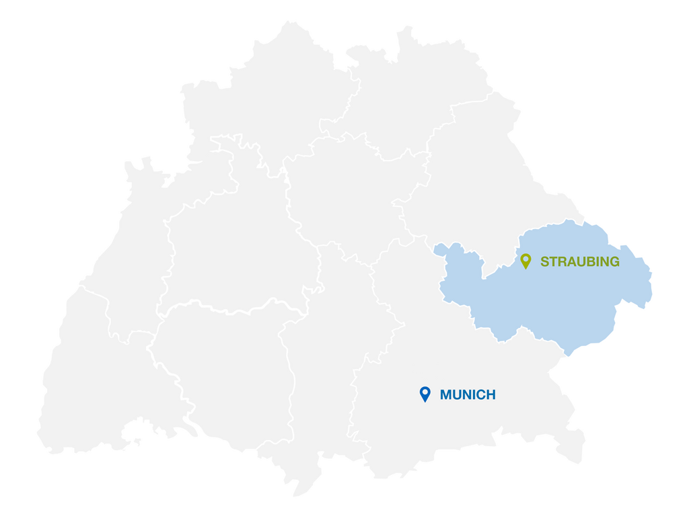

---
hide:
    - navigation
---

# TUM Campus Straubing iGEM Team

## Who We Are

The iGEM Straubing team represents the **student-led** synthetic biology team from TUM Campus Straubing. As part of the International Genetically Engineered Machine (iGEM) competition, we are a dynamic and multidisciplinary group of undergraduate, graduate, (and advisory PhD) students united by our passion for synthetic biology, sustainable innovation, and real-world impact.

Our team combines diverse expertise from chemical biotechnology, bioprocessing, biogenic energy utilization, and business exertise—reflecting the unique interdisciplinary and international character of our campus. This diversity is our strength, enabling us to approach complex scientific challenges from multiple perspectives and develop holistic, innovative solutions.

### Technical University of Munich Campus Straubing

The Technical University of Munich (TUM) Campus Straubing for Biotechnology and Sustainability is an Integrative Research Institute of the Technical University of Munich, uniquely positioned at the intersection of natural sciences, biotechnology, engineering, and economics. Located in Straubing—the region of renewable resources—our campus is at the heart of developing and scaling biotechnological processes.

{ align=right }

 
Our campus offers interdisciplinary study programs including:

- Bioeconomy (B.Sc. & M.Sc.)

- Chemical Biotechnology (B.Sc. & M.Sc.)

- Biomass Technology (M.Sc.)

    Sustainable Energy and Processes (M.Sc.)

- Sustainable Management and Technology

    (B.Sc. & M.Sc.)

This multidisciplinary environment provides our team with access to cutting-edge facilities, diverse expertise, and a community committed to developing sustainable technologies that address pressing global issues.

## The iGEM Competition
The iGEM Competition is an annual, worldwide synthetic biology event aimed at undergraduate university students, as well as high school and graduate students. Multidisciplinary teams work together to design, build, test, and measure a system of their own design using interchangeable biological parts and standard molecular biology techniques. You can find more information in the official iGEM documentation:

* [What is the process that an iGEM project goes through?](https://competition.igem.org/about/navigating-igem)

## Our Achievements at iGEM

### iGEM 2024: Bluebear Bio Project

In our inaugural year competing as the very first iGEM team from TUM Campus Straubing, we achieved remarkable success with our [**Bluebear Bio: Cell-Free for All**](https://2024.igem.wiki/tum-straubing/) project.   
Our 2024 project focused on developing desiccated cell-free transcription-translation (TXTL) systems to make synthetic biology tools more accessible worldwide. By harnessing tardigrade proteins' resilience and developing cost-effective energy mixes, we created a solution that eliminates cold chain requirements and significantly reduces expenses. This innovation opens new opportunities for labs in resource-limited areas, advancing democratization of biotechnology.

{ align=left }

??? success "**Awards & Recognition:**"

    * 🥇 **Gold Medal** - Our first gold medal as iGEM Straubing
    * 🌟 **Top 10 Overgraduate Projects** - Among all teams in iGEM 2024
    * 🧬 **Nominated for Best Biomanufacturing Project** - Recognition in our village category
    * 💻 **Nominated for Best Wiki** - Among overgraduate teams

## Join Us

We are always looking for passionate students interested in synthetic biology, innovation, and creating real-world solutions to global challenges. Regardless of your field of study, if you're curious about how synthetic biology can shape a more sustainable future, we welcome you to join our team.
**Regular onboarding start at the beginning of November**

??? question "**What you'll gain:**"

    - 🔬 Learn and apply cutting-edge science
    - 🤝 Collaborate with like-minded individuals from diverse fields
    - 🌍 Create real-world solutions to global challenges
    - 🏆 Compete at the international level at the Grand Jamboree in Paris
    - 📈 Develop transferable skills in research, project management, and science communication
    - 🌱 Contribute to sustainable innovation

You can join one of many specialised teams:

-   **Wet Lab**

    ---

    Hands-on laboratory research, experimental design, and protocol development

- **Dry Lab**

    ---

    Computational modeling, data analysis, and bioinformatics

- **Human Practices & Social Media:**

    ---

    Social Engagement in the Team, on Campus and Online

- **Project Management:**

    ---

    Coordination, administration, finances

 
**For more information on how to join or contribute, please shoot us a message and:**

[Follow us on Instagram](https://www.instagram.com/igem.straubing/){ .md-button .md-button--primary }

[Follow us on LinkedIn](https://www.linkedin.com/company/igem-tum-campus-straubing/ ){ .md-button .md-button--primary }

 
